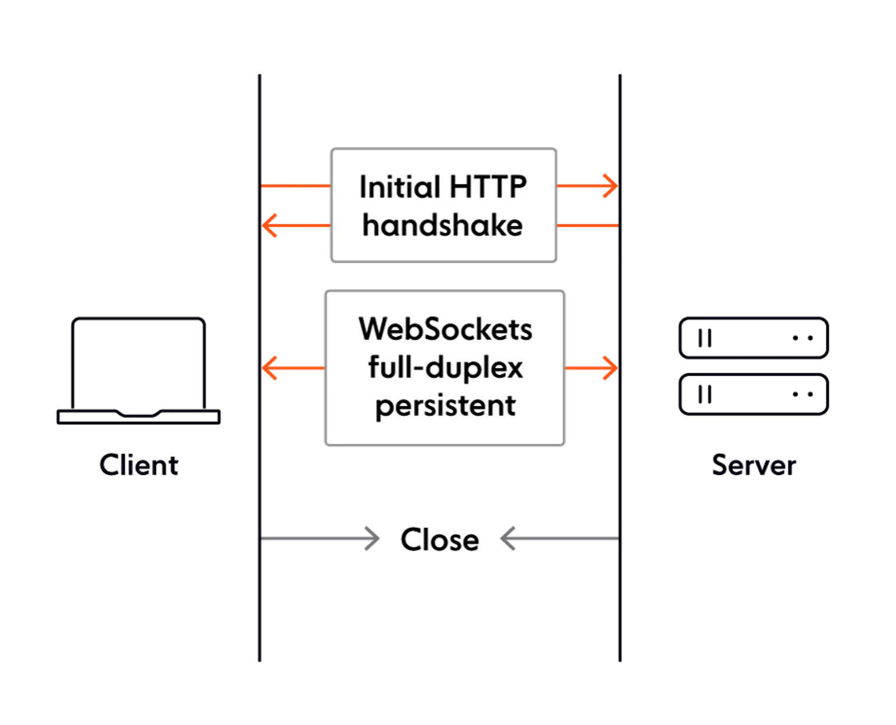

# Chat-Application

Building a chat application with Spring Boot and WebSocket

## WebSocket

WebSocket is a communication protocol that makes it possible to establish a two-way communication channel between a
server and a client.

WebSocket works by first establishing a regular HTTP connection with the server and then upgrading it to a bidirectional
websocket connection by sending an <strong>Upgrade header</strong>.

## Technologies used

### Java 17

### Spring Boot 2.7.3

### websocket

### Maven
